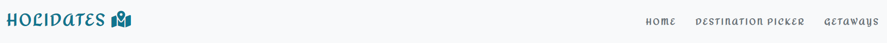
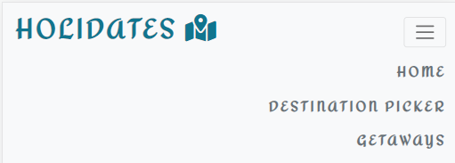
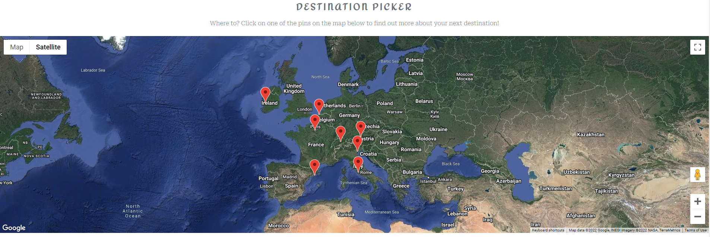

# HoliDates

[Here is a link to the final project](https://manni8436.github.io/HoliDates/)

## INITIAL DESIGN

* The initial idea for this project was to create a website where a user to be able to get help on selecting a romantic getaways or a honeymoons destination. While also being able to use the website destination picker that gives them more information and the exact location.

## FINAL DESIGN

## CONTENTS

* [User Experience](#user-experience)  
  * [User Stories](#user-stories)

* [Design](#design)
  * [Color Scheme](#color-scheme)

* [Wireframes](#wireframes)

* [Features](#features)
  * [Future Implementations](#future-implementations)
  
* [Solved Bugs](#solved-bugs)

* [Technologies Used](#technologies-used)
  * [Languages](#languages)
  * [Design](#design)
  * [Database](#database)

* [Deployment](#deployment)
  * [Initial Deployment](#initial-deployment)
  * [How To Fork A Repository](#how-to-fork-a-repository)
  * [How To Clone A Repository](#how-to-clone-a-repository)
  * [How To Make A Local Clone](#how-to-make-a-local-clone)

* [Testing](#testing)
  * [Code Validators](#code-validators)

* [Content](#content)
  * [Images](#images)
  * [Text Content](#text-content)

* [Acknowledgements](#acknowledgements)

[Back To Top](#HoliDates)

## USER EXPERIENCE

[Back To Top](#HoliDates)

### USER STORIES

+ As a user, I would like to be able to …

1.  Easily navigate throughout the website;
2.  Check different place options to a romantic trip on map;
3.  Be able to check place details when click on map mark;
4.  Be able to find information about romantic and honeymoon gateways;

#### CLIENT GOALS

#### FIRST TIME VISITORS

#### RETURNING USER

## DESIGN

### COLOR SCHEME

The colour scheme was generated using hero image, and [coolors](https://coolors.co/) to generate the colour pallet.

[Back To Top](#HoliDates)

## WIREFRAMES

Wireframes were created using [Balsamiq](https://balsamiq.com/) and exported into a pdf format, which can be viewed [here](assets/wireframes/love-hackathon.pdf)

## FEATURES

### Navbar 

+ Fixed Navbar with Home, Destination Picker, Getaways and tips options to allow the user easy access to all sections. 

+ Collapsed navbar on smaller devices to wrap in all options and assure better navbar design.

###  Destination Picker section 

+ Google maps with markers on listed romantic destinations

+ When users click on a destination, they can check the place with a zoom in and a pop up modal with destination details shown on the centre of the page.
 

###  Getaways section 

+ Divided into two - Romantic and Honeymoon - users can find several destinations accordingly with their interest. 
 

### Footer

+ Divided into three areas - site name, team, social media links. The team name links allow the user to access each team member's GitHub page. 

[Back To Top](#HoliDates)

### FUTURE IMPLEMENTATIONS

## SOLVED BUGS

No major bugs were found during the production of this project, just a few typos and stray tags

## TECHNOLOGIES USED

### LANGUAGES

   

[Back To Top](#HoliDates)

### FRAMEWORKS, LIBRARIES AND PROGRAMS USED

#### Am I Responsive

[Am i Responsive](http://ami.responsivedesign.is/) was used to create the image in my [Final Design](#final-design) section.

#### Bootstrap 5.1

[Bootstrap](https://getbootstrap.com/docs/5.1/getting-started/introduction/) was used to assist with the style and responsiveness.

#### Favicon generator

[Favicon](https://favicon.io/) was used to create favicon for the website.

#### Firefox Developer Tools

[Firefox Developer](https://www.mozilla.org/en-GB/firefox/developer/) Tools was used for troubleshooting and trying new visual changes without it affecting the current code.

#### Git

[Git](https://git-scm.com/) was used for version control by using the Gitpod terminal to add and commit to Git and push to Github.

#### GitPod

[GitPod](https://gitpod.io) was used as an IDE whilst coding this site.

#### GitHub

[GitHub](https://github.com/) is being used to store all the code for this project after being pushed from GitPod.

#### Lighthouse

[Lighthouse](https://developers.google.com/web/tools/lighthouse) was used to ensure that the site was performing well, conforming to best practices, SEO and Accessibility guidelines.

### DESIGN

#### Font Awesome

[Font Awesome](https://fontawesome.com/) was used for a few icons in the footer on all of this site's pages.

#### Google Fonts

[Google Fonts](https://fonts.google.com/) was used for all the text content on the site pages.

#### Balsamiq

[Balsamiq](https://balsamiq.com/) was used in the initial design process to make wireframes.

#### Coolors

[Coolors](https://coolors.co/) was used for the colour palette on the page, based on the hero image. 

## DEPLOYMENT

### INITIAL DEPLOYMENT

This site was deployed using GitHub Pages with the following the steps below:

1. Login or Sign Up to [GitHub](www.github.com).
2. Create a new repository named "HoliDates".
3. Once created, click on "Settings" on the navigation bar under the repository title.
4. Click on "Pages", on the left hand side below Secrets.
5. Under "Source", choose which branch you wish to deploy, In most cases it will be "main".
6. Choose which folder to deploy from, generally from "/root".
7. Click "Save", then wait for it to be deployed. It may take some time for the page to be fully deployed.
8. The URL will be displayed above the "source" section in GitHub Pages.

### HOW TO FORK A REPOSITORY

If you need to make a copy of a repository:

1. Login or Sign Up to [GitHub](www.github.com).
2. On GitHub, go to [manni8436/HoliDates](manni8436/HoliDates).
3. In the top right corner, click "Fork".

### HOW TO CLONE A REPOSITORY

If you need to make a clone:    

1. Login in to [GitHub](www.github.com).
2. Fork the repository "manni8436/HoliDates" using the steps above in [How To Fork a Repository](#HOW-TO-FORK-A-REPOSITORY).
3. Above the file list, click "Code".
4. Choose if you want to close using HTTPS, SSH or GitHub CLI, then click the copy button to the right.
5. Open Git Bash.
6. Change the directory to where you want your clone to go.
7. Type git clone and then paste the URL you copied in step 4.
8. Press Enter to create your clone.

### HOW TO MAKE A LOCAL CLONE

If you need to make a local clone:   

1. Login in to [GitHub](www.github.com).
2. Under the repository name, above the list of files, click "Code".
3. Here you can either Clone or Download the repository.
4. You should close the repository using HTTPS, clicking on the icon to copy the link.
5. Open Git Bash.
6. Change the current working directory to the new location, where you want the cloned directory to be.
7. Type git clone and then paste the URL you copied in step 4.
8. Press Enter, and your local clone will be created.

## TESTING

### CODE VALIDATORS

+ HTML

  Passing the HTML from index into the (X)HTML5 Validator no errors or warnings have been found [Validator.nu](https://html5.validator.nu/).
  
Code Validation results:
  
[Index Page](assets/images/htmlvalidation.jpg)  

   + CSS

No errors were found when passing through the official [CSSlint](http://csslint.net). 

CSS validation results can be viewed [here](assets/images/cssvalidation.jpg)

 25 (not relevant) warning have been found.

CSS validation  warnings can be viewed [here](assets/images/csswarnings.jpg)
[Index Page](assets/images/htmlvalidation.jpg)  

+ JavaScript

Both javascript files have been tested with the jshint and no error were been found. 

Reports can be found on links:

[maps.js](assets/images/jsvalidation_maps.jpg) &nbsp; 
[floatingText.js](assets/images/jsvalidation_floatingText.jpg) &nbsp; 

  
### FULL TESTING

[Click Here](testing.md) to view the full testing steps that were completed on every device and browser.

### LIGHTHOUSE

Lighthouse tools have also been used to ensure SEO and achieve high performance on the website.

### DESKTOP

#### Performance

#### Accessibility

#### Best Practices

#### SEO

## CONTENT

### MEDIA

- All pictures and images used in this project are from [Unsplash](https://unsplash.com/) or [Pexels](https://www.pexels.com/).

### TEXT CONTENT

All text content used in this project can be seen below.

+ Description

- [Venice ](https://www.visit-venice-italy.com/history-love-venice-italy.html/)
- [Salzburg ](https://traveltoaustria.info/romantic-encounters-in-salzburg/)
- [Barcelona ](https://theculturetrip.com/europe/spain/articles/how-to-spend-the-most-romantic-weekend-in-barcelona/)
- [Bruges ](https://www.visitbruges.be/en/romantic-hotspots-2)
- [Rome ](https://www.bigbustours.com/en/rome/romantic-things-to-do-rome/)
- [Cliffs of Moher ](https://www.tenontours.com/top-10-romantic-places-in-ireland-to-visit/)
- [Lucerne ](https://www.nationalgeographic.com/travel/article/how-to-spend-a-perfect-weekend-in-lucerne)

+ Tips

- [Paris](https://worldinparis.com/visiting-paris-tips)
- [Venice](https://theculturetrip.com/europe/italy/articles/the-top-10-things-to-do-and-see-in-venice/)
- [Salzburg](https://traveltoaustria.info/romantic-encounters-in-salzburg/)
- [Barcelona](https://theculturetrip.com/europe/spain/articles/11-essential-tips-for-first-timers-in-barcelona/)
- [Bruges](https://theculturetrip.com/europe/belgium/articles/10-things-to-know-before-you-go-to-bruges/)
- [Rome](https://theculturetrip.com/europe/italy/articles/the-best-things-to-do-in-rome/)
- [Cliffs of Moher](https://culturetourist.com/destinations/ireland/day-trip-from-dublin-cliffs-of-moher-galway/)
- [Lucerne](https://theculturetrip.com/europe/switzerland/articles/top-10-things-to-see-and-do-in-lucerne-switzerland/)

### Code Credit

## ACKNOWLEDGEMENTS

- [Stack Overflow](https://stackoverflow.com/) as a valuable resource for solving a several issues.
- [W3schools](https://www.w3schools.com/) for general reference.
- [Google Developer](https://developers.google.com/maps/documentation) for general reference about google maps API.

[Back To Top](#HoliDates)