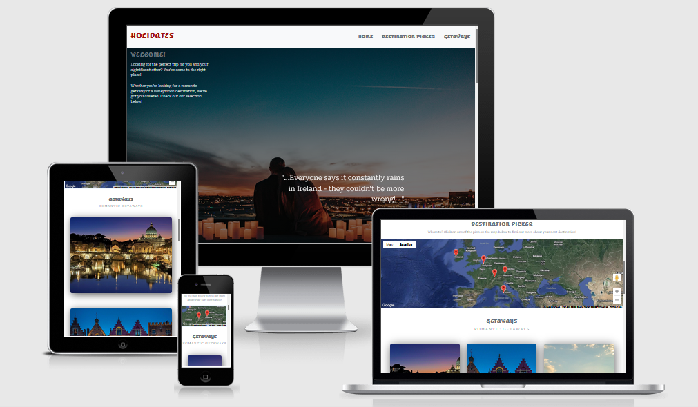

## **Contents**

* [**Testing**](#testing)
  * [**Navigation**](#navigation)
  * [**Google API Map**](#Google-API-Map)
  * [**Getaways**](#Getaways)
  * [**Honeymoon**](#Honeymoon)
  * [**Buttons**](#Buttons)
  
  
# **Testing**

### **Navigation** 
    
| Feature        | Expected           | Testing  | Result | Pass/Fail |
| ------------- |-------------| -----|  ---------- | :----: |
| Home Link     | To redirect to top of page/hero image | Click the Home Link | Link redirected to top of page/hero image | Pass |
| Destination Picker Link    | To redirect to Destination Picker section | Click the Destination Picker Link | Link navigates to Destination Picker section | Pass |
| Getaways Link    | To redirect to Getaways Link | Click the getaways Link | Link navigates to getaways section | Pass |

### **Google API Map** 

| Feature        | Expected           | Testing  | Result | Pass/Fail |
| ------------- |-------------| -----|  ---------- | :----: |
| Destination pins     | To zoom into location and show description/tips & tricks modal | Clicked all Destination pins | zoomed into location and showed description/tips & tricks modal | Pass |

### **Getaways** 
    
| Feature        | Expected           | Testing  | Result | Pass/Fail |
| ------------- |-------------| -----|  ---------- | :----: |
| Rome Image     | To open description/tips & tricks modal  | Click the Rome Image | opened description/tips & tricks modal | Pass |
| Bruges Image     | To open description/tips & tricks modal  | Click the Bruges Image | opened description/tips & tricks modal | Pass |
| Lucerne Image     | To open description/tips & tricks modal  | Click the Lucerne Image | opened description/tips & tricks modal | Pass |
| Salzburg Image     | To open description/tips & tricks modal  | Click the Salzburg Image | opened description/tips & tricks modal | Pass |
| Cliff of Moher Image     | To open description/tips & tricks modal  | Click the  Cliff of Moher Image | opened description/tips & tricks modal | Pass |

### **Honeymoon** 
    
| Feature        | Expected           | Testing  | Result | Pass/Fail |
| ------------- |-------------| -----|  ---------- | :----: |
| Paris Image     | To open description/tips & tricks modal  | Click the Paris Image | opened description/tips & tricks modal | Pass |
| Barcelona Image     | To open description/tips & tricks modal  | Click the Barcelona Image | opened description/tips & tricks modal | Pass |
| Venice Image     | To open description/tips & tricks modal  | Click the Venice Image | opened description/tips & tricks modal | Pass |

### **Buttons** 
    
| Feature        | Expected           | Testing  | Result | Pass/Fail |
| ------------- |-------------| -----|  ---------- | :----: |
| Modal Close Buttons     | To close description/tips & tricks modal  | Click the Close Button | closed description/tips & tricks modal | Pass |
| Back To Top Button     | To go back to the top of the page  | Click Back To Top Button | goes back to the top of the page | Pass |
| Github Team Member Names Buttons     | To go to each GitHub repo in a new page  | Clicks each Team Member Names | goes each GitHub repo in a new page | Pass |
| Social Media Buttons     | To go to each social media platform in a new page  | Clicks each Social Media buttons | goes to each social media platform in a new page | Pass |

[Back to contents](#contents)